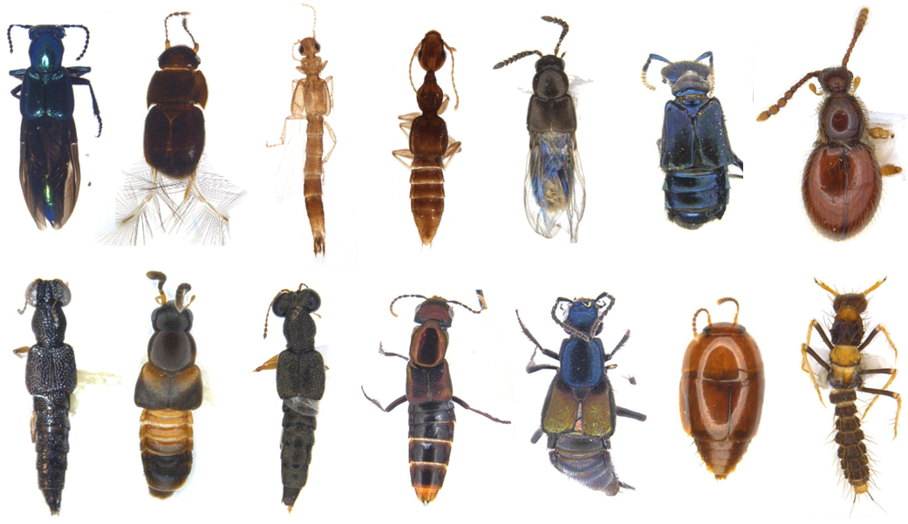

The Staphylinidae community on volcan Cacao at Área de Conservación Guanacaste (ACG), Costa Rica, has been found to be extremely diverse and mostly undescribed (over 300 species, 80% without genus-level classification and 99% without species names). They have also been found to increase in number of species as you go up in elevation, a trend that goes against the most reported patterns of diversity and elevation. There may be many reasons as to why this is the case, but it is likely that this explosion in diversity at higher elevations might be due to the reduced levels of variability in temperature that exist along this elevational gradient. If this is true, we should expect to see species with thermal tolerances (heat and cold) that mirror that degree of variability. And wouldn't you know it, that is precisely what we found. We also found that the though low elevation beetles have higher heat tolerances, they also live at temperatures that are much closer to their limits than do their high elevation counterparts. In turn, not only do the high elevation beetles have low heat tolerances, but they also have very little variability in that trait, which means increased occurrences of extreme temperature events at high elevations will present an important challenge for that community. You can read more about my findings <a href="https://hdl.handle.net/10214/29154" target="_blank">here</a>.
