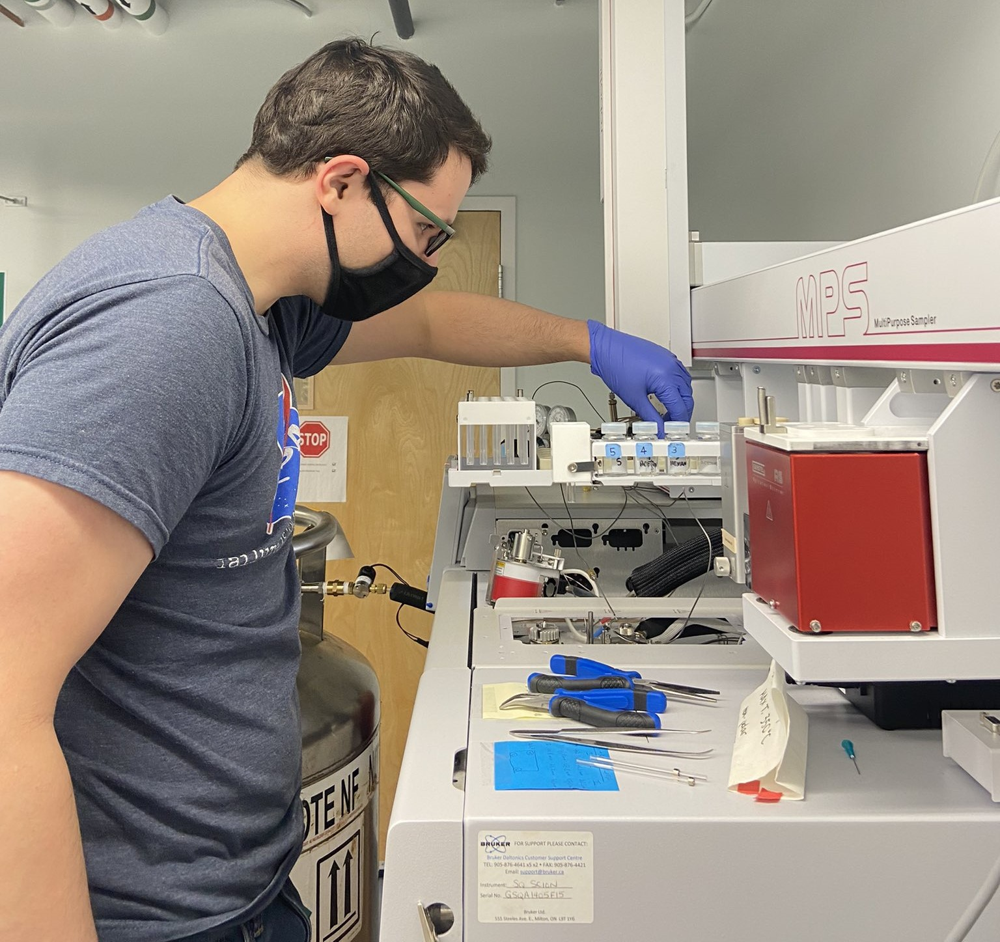

Thermal tolerance, both heat and cold, are often associated with an organism's water balance, and therefore, their ability to lose or retain water. The primary barrier to water loss in insects is a layer of lipids on their cuticles that contain long-chain saturated hydrocarbons that have water-proofing abilities. In this project, I partnered up with <a href="https://chemistry.acadiau.ca/dr-nicoletta-faraone.html" target="_blank">Dr. Nicoletta Faraone</a> at Acadia University to measure the relative abundance of the cuticular lipid layer of the Staphylinidae community from volcano Cacao, at the Área de Conservación Guanacaste, Costa Rica. We found that the amount of long-chain saturated hydrocarbons (relative to other chemicals on the cuticle) did not change with elevation across the entire community, whether that was at the community level, the largest beetles only, or the most widely distributed species along the elevational gradient. These beetles likely rely on behavioural adaptations to regulate their wate balance, such as searching for sites with water. This is troubling, given that precipitation levels on this volcano are decreasing and becoming less predictable. You can read more about our findings <a href="https://hdl.handle.net/10214/29154" target="_blank">here</a>.
